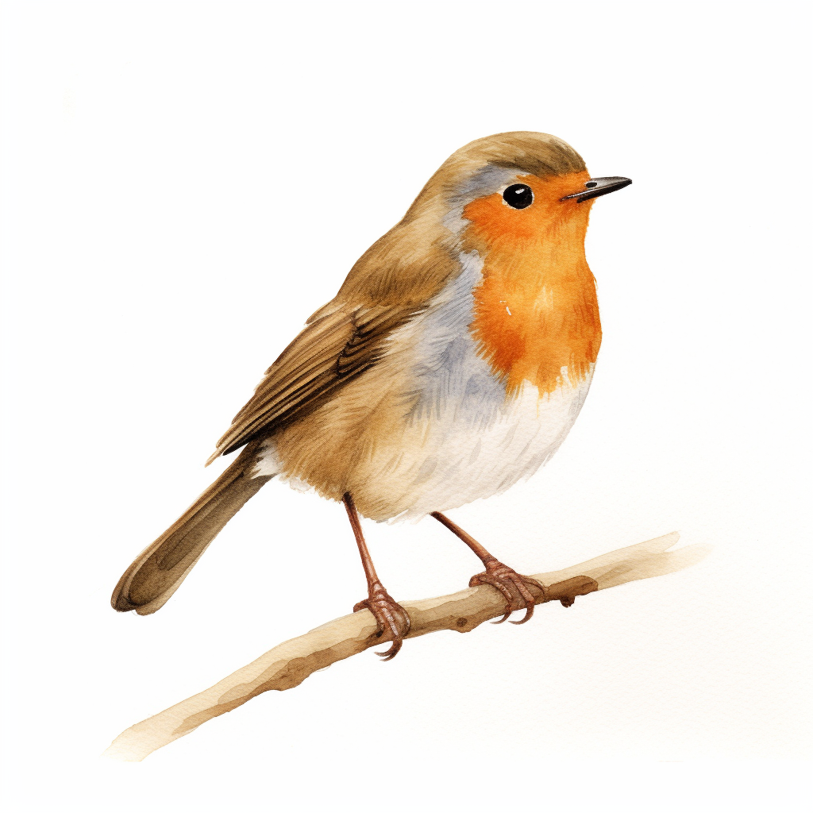

## Robingrad

<h1 align="center">

</h1> 

 

Something between George Hotz [Tinygrad](https://github.com/tinygrad/tinygrad) and Andrej karpathy [Micrograd](https://github.com/karpathy/micrograd).

